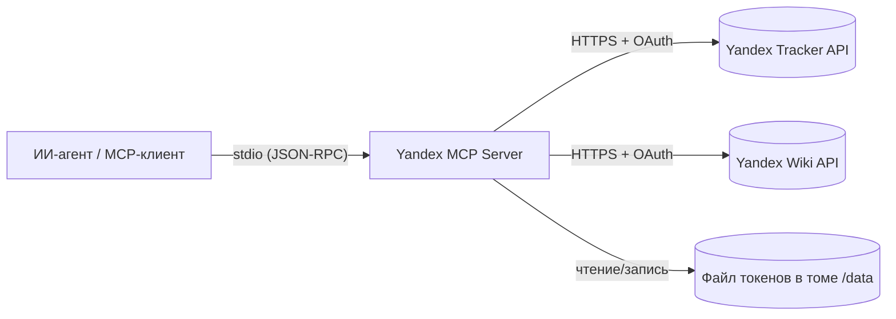
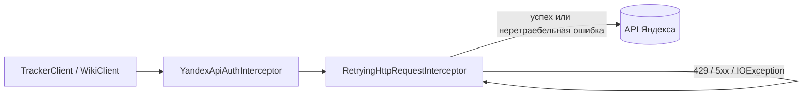

# Архитектура MCP-сервера для Yandex Tracker и Yandex Wiki

## Содержание

- [Краткое описание](#краткое-описание)
- [Для кого этот документ](#для-кого-этот-документ)
- [Общая идея](#общая-идея)
- [Технологический стек](#технологический-стек)
- [Структура пакетов](#структура-пакетов)
- [Транспорт stdio и правило чистого stdout](#транспорт-stdio-и-правило-чистого-stdout)
- [Регистрация инструментов](#регистрация-инструментов)
- [Конфигурация](#конфигурация)
- [Устойчивость к сбоям и режим только для чтения](#устойчивость-к-сбоям-и-режим-только-для-чтения)
- [Этап M0: что сделано](#этап-m0-что-сделано)
- [Проверка работоспособности](#проверка-работоспособности)
- [Дальнейшие этапы](#дальнейшие-этапы)
- [Открытые вопросы](#открытые-вопросы)

## Краткое описание

Документ описывает архитектуру сервера и фиксирует состояние после этапа M0 — создания каркаса проекта. Он объясняет, как устроен сервер, почему выбран такой стек и как добавляются новые инструменты.

## Для кого этот документ

Документ рассчитан на разработчиков сервера и технических специалистов, сопровождающих проект.

## Общая идея

Сервер — это посредник между ИИ-агентом и REST API Яндекса. Агент общается с сервером по протоколу MCP, вызывая инструменты. Сервер преобразует вызов инструмента в HTTP-запрос к API Tracker или Wiki, добавляет авторизацию и заголовок организации, получает ответ и возвращает агенту структурированный результат.



Ключевые шаги:

1. MCP-клиент запускает сервер как подпроцесс и обменивается сообщениями через stdin/stdout.
2. Клиент запрашивает список инструментов, сервер отдаёт их описания и схемы параметров.
3. При вызове инструмента сервер обращается к нужному API Яндекса и возвращает результат.

## Технологический стек

| Слой | Технология | Назначение |
|---|---|---|
| Язык и сборка | Kotlin + Maven | Основной стек проекта |
| Каркас приложения | Spring Boot 3 | Внедрение зависимостей, конфигурация |
| Протокол MCP | Spring AI MCP Server (stdio) | Авто-публикация инструментов и обработка транспорта |
| HTTP-клиент | Spring RestClient | Запросы к API Tracker и Wiki |
| Тесты | JUnit 5, MockK, AssertJ, WireMock | Модульные и интеграционные тесты |

## Структура пакетов

Структура ориентирована на предметные области. Каждая область делится на слои `api`, `application`, `domain`, `infrastructure`.

```
com.sorface.mcp.yandex
├── config            # Конфигурация Spring, свойства, регистрация инструментов
├── system            # Служебные инструменты (ping, статус авторизации)
│   └── api
├── auth              # OAuth 2.0 Device Flow и хранение токенов (реализовано, M1)
├── common            # Общий код: заголовки организации, обработка ошибок, пагинация
├── tracker           # Инструменты и клиент Tracker (этапы M2, M3)
└── wiki              # Инструменты и клиент Wiki (этапы M4, M5)
```

Назначение слоёв:

- `api` — компоненты с инструментами MCP. Тонкий слой: разбор входных параметров, вызов сервиса, формирование ответа. Без бизнес-логики.
- `application` — сервисы и сценарии использования, описанные интерфейсами.
- `domain` — модели данных (неизменяемые `data class`).
- `infrastructure` — HTTP-клиенты к внешним API и доступ к хранилищу токенов.

## Транспорт stdio и правило чистого stdout

Сервер работает по транспорту stdio. Поток stdout используется как протокольный канал MCP. Поэтому действует строгое правило: **в stdout не должно попадать ничего, кроме сообщений протокола**.

Что для этого настроено:

- `spring.main.banner-mode=off` — отключён баннер Spring.
- `spring.main.web-application-type=none` — приложение не поднимает веб-сервер.
- `logback-spring.xml` направляет все логи только в stderr.

Нарушение этого правила (например, вывод `println` в stdout) ломает обмен с MCP-клиентом.

## Регистрация инструментов

Инструменты — это методы, помеченные аннотацией `@Tool` из Spring AI. Они собираются в один провайдер `ToolCallbackProvider` в классе `ToolsConfiguration`. По мере роста проекта в провайдер добавляются компоненты Tracker и Wiki.

Пример объявления инструмента:

```kotlin
@Tool(name = "system_ping", description = "Проверка доступности MCP-сервера.")
fun ping(): String = "pong"
```

Соглашение об именовании: `tracker_<сущность>_<действие>` и `wiki_<сущность>_<действие>`.

## Конфигурация

Настройки описаны классом `YandexProperties` (`@ConfigurationProperties(prefix = "yandex")`) и задаются переменными окружения. Тип организации (`orgType`) определяет, какой заголовок идентификатора организации добавляется в запросы: `X-Org-ID` для Яндекс 360 или `X-Cloud-Org-ID` для Yandex Cloud.

## Устойчивость к сбоям и режим только для чтения

### Повторные запросы

Клиенты Tracker и Wiki используют общий `RestClient`, в цепочку интерсепторов которого последним
добавлен `RetryingHttpRequestInterceptor`. Он повторяет запрос при временных сбоях:

- сетевые ошибки (`IOException` — соединение не установлено или разорвано);
- превышение лимита запросов (`429`);
- временные ошибки сервиса (`5xx`).

Задержка между попытками растёт экспоненциально и ограничена сверху (`yandex.retry.*`). Для ответа
`429` с заголовком `Retry-After` используется указанное в нём время. Прочие ошибки (например, `4xx`,
кроме `429`) не повторяются и сразу пробрасываются выше для перевода в понятное сообщение.

Интерсептор намеренно стоит последним в цепочке: повторный вызов `execution.execute(...)` формирует
новый фактический HTTP-запрос, поэтому заголовки авторизации и организации, добавленные интерсептором
`YandexApiAuthInterceptor`, сохраняются между попытками.



### Режим только для чтения

При `yandex.read-only=true` действует двойная защита:

1. **Инструменты не регистрируются.** `ToolsConfiguration` не добавляет в провайдер наборы
   изменяющих инструментов (`TrackerWriteTools`, `WikiWriteTools`), поэтому агент не видит их в
   `tools/list` и не может вызвать. Инструменты таблиц Wiki (`WikiGridTools`) содержат и чтение, и
   запись, поэтому регистрируются всегда.
2. **Проверка на уровне сервиса.** Каждая изменяющая операция вызывает `WriteGuard.ensureWritable(...)`,
   который в режиме только для чтения отклоняет запрос исключением `ReadOnlyModeException`. Это
   защищает изменяющие методы, оставшиеся доступными (например, в `WikiGridTools`).

Текущий режим работы сервер сообщает служебным инструментом `system_server_info`.

## Этап M0: что сделано

1. Создан Maven-проект на Kotlin со Spring Boot и Spring AI MCP Server.
2. Настроен транспорт stdio с чистым stdout.
3. Добавлен класс конфигурации `YandexProperties` со всеми переменными окружения.
4. Реализованы служебные инструменты `system_ping` и `yandex_auth_status`.
5. Подготовлены Docker-образ (многоэтапная сборка) и точка входа с командами `serve` и `auth`.
6. Добавлены модульные тесты конфигурации и служебных инструментов.

## Проверка работоспособности

Сервер протестирован сценарием stdio: после запроса `initialize` и уведомления `notifications/initialized` запрос `tools/list` возвращает инструменты `system_ping` и `yandex_auth_status`. Это подтверждает корректную работу транспорта и регистрации инструментов.

## Дальнейшие этапы

| Этап | Содержание |
|---|---|
| M1 (готово) | Авторизация OAuth 2.0 Device Flow, хранение и обновление токенов, команда `auth`. См. [docs/auth.md](./auth.md) |
| M2 (готово) | Tracker: чтение задач, очереди, справочники, текущий пользователь, общий HTTP-клиент и маппинг ошибок. См. [docs/tracker.md](./tracker.md) |
| M3 (готово) | Tracker: создание и изменение задач, переходы по статусам, комментарии и связи, режим только для чтения. См. [docs/tracker.md](./tracker.md) |
| M4 (готово) | Wiki: страницы, комментарии, вложения, общий клиент и маппинг ошибок. См. [docs/wiki.md](./wiki.md) |
| M5 (готово) | Wiki: динамические таблицы, строки, столбцы, ячейки. См. [docs/wiki.md](./wiki.md) |
| M6 (готово) | Повторные запросы при временных сбоях, доводка режима `READ_ONLY`, расширение тестов, доводка Docker. См. раздел [Устойчивость к сбоям и режим только для чтения](#устойчивость-к-сбоям-и-режим-только-для-чтения) |

## Открытые вопросы

| Вопрос | Почему важно уточнить | Кто может ответить |
|---|---|---|
| Тип организации по умолчанию | Влияет на заголовок идентификатора организации | Заказчик |
| Нужны ли два транспорта (stdio и HTTP) в будущем | Влияет на выбор стартеров Spring AI | Заказчик |
