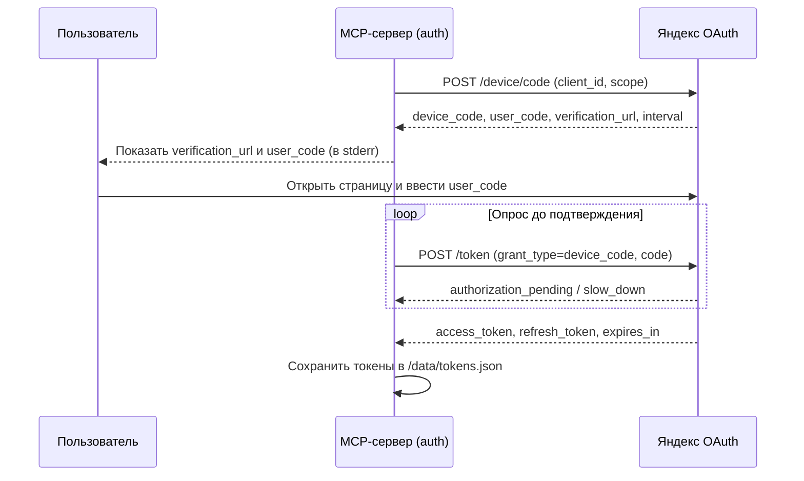

# Авторизация: OAuth 2.0 Device Flow

## Содержание

- [Краткое описание](#краткое-описание)
- [Для кого этот документ](#для-кого-этот-документ)
- [Зачем это нужно](#зачем-это-нужно)
- [Основные понятия](#основные-понятия)
- [Как это работает](#как-это-работает)
- [Порядок работы](#порядок-работы)
- [Хранение и обновление токенов](#хранение-и-обновление-токенов)
- [Настройки](#настройки)
- [Состав компонентов](#состав-компонентов)
- [Ошибки и их причины](#ошибки-и-их-причины)
- [Ограничения и важные условия](#ограничения-и-важные-условия)
- [Открытые вопросы](#открытые-вопросы)

## Краткое описание

Документ описывает, как MCP-сервер получает доступ к API Yandex Tracker и Yandex Wiki по протоколу OAuth 2.0, сценарий Device Flow. После прочтения должно быть понятно, как выполнить первичную авторизацию, где хранятся токены и как они обновляются.

## Для кого этот документ

Документ рассчитан на смешанную аудиторию: тех, кто настраивает и запускает сервер, и разработчиков, сопровождающих код. Сначала объясняется смысл и порядок действий, затем приводятся технические детали.

## Зачем это нужно

API Яндекса принимает запросы только с действующим токеном доступа. Сервер не умеет «угадывать» токен — его нужно один раз получить с подтверждением пользователя. Device Flow удобен тем, что подтверждение делается в браузере на отдельной странице, а серверу не нужен веб-интерфейс и адрес для обратного вызова (redirect URI).

## Основные понятия

| Понятие | Простое объяснение |
|---|---|
| `client_id` | Идентификатор приложения, зарегистрированного в Яндекс OAuth |
| `client_secret` | Секретный ключ приложения |
| Device Flow | Сценарий, при котором пользователь подтверждает доступ по короткому коду на странице Яндекса |
| `user_code` | Короткий код, который пользователь вводит на странице подтверждения |
| `verification_url` | Адрес страницы подтверждения |
| Токен доступа (`access_token`) | Ключ для обращения к API; имеет ограниченный срок действия |
| Токен обновления (`refresh_token`) | Ключ для получения нового токена доступа без повторного подтверждения |

## Как это работает

Авторизация состоит из двух частей: разовое подтверждение пользователем (команда `auth`) и последующая автоматическая работа сервера (команда `serve`).



Ключевые шаги:

1. Сервер запрашивает коды устройства и пользователя.
2. Пользователь подтверждает доступ на странице Яндекса.
3. Сервер опрашивает сервис OAuth, пока доступ не подтверждён.
4. После подтверждения токены сохраняются в файле в подключённом томе.
5. В режиме `serve` сервер берёт сохранённый токен и при необходимости обновляет его.

## Порядок работы

Первичная авторизация выполняется командой `auth`. Пример запуска в Docker:

```bash
docker run -it --rm \
  -e YANDEX_CLIENT_ID=<client_id> \
  -e YANDEX_CLIENT_SECRET=<client_secret> \
  -e YANDEX_ORG_ID=<org_id> \
  -e YANDEX_ORG_TYPE=YANDEX_360 \
  -v yandex-mcp-tokens:/data \
  yandex-mcp:latest auth
```

Сервер выведет в stderr адрес подтверждения и код пользователя:

```text
Откройте адрес: https://ya.ru/device
Введите код:    ABCD-1234
Ожидание подтверждения...
```

После подтверждения в браузере токены сохранятся в том `/data`. Дальше сервер запускается в обычном режиме `serve` и использует сохранённые токены.

Проверить состояние авторизации можно инструментом `yandex_auth_status`: он показывает, заданы ли настройки, есть ли действующий токен и когда он истекает.

## Хранение и обновление токенов

- Токены сохраняются в JSON-файле по пути из настройки `token-store-path` (по умолчанию `/data/tokens.json`).
- На POSIX-системах на файл выставляются права `600`, чтобы ограничить доступ к секретам.
- Перед каждым обращением к API сервер проверяет срок действия токена доступа. Если до истечения остаётся менее 60 секунд, токен обновляется по токену обновления автоматически.
- Если токен обновления отсутствует или недействителен, требуется повторная авторизация командой `auth`.

## Настройки

| Переменная окружения | Назначение |
|---|---|
| `YANDEX_CLIENT_ID` | Идентификатор приложения Яндекс OAuth |
| `YANDEX_CLIENT_SECRET` | Секретный ключ приложения |
| `YANDEX_ORG_ID` | Идентификатор организации |
| `YANDEX_ORG_TYPE` | Тип организации: `YANDEX_360` или `YANDEX_CLOUD` |
| `YANDEX_OAUTH_BASE_URL` | Базовый адрес сервиса OAuth (по умолчанию `https://oauth.yandex.com`) |
| `YANDEX_OAUTH_SCOPES` | Запрашиваемые разрешения через пробел |
| `YANDEX_TOKEN_STORE_PATH` | Путь к файлу токенов (по умолчанию `/data/tokens.json`) |

## Состав компонентов

| Компонент | Слой | Назначение |
|---|---|---|
| `YandexOAuthClient` | application (порт) | Контракт обращений к сервису OAuth |
| `RestClientYandexOAuthClient` | infrastructure | Реализация на `RestClient`: запрос кода, опрос, обновление |
| `TokenStore` | application (порт) | Контракт хранилища токенов |
| `FileTokenStore` | infrastructure | Файловое хранилище токенов в томе |
| `AuthService` / `DefaultAuthService` | application | Сценарий авторизации и выдача действующего токена |
| `AuthCommandRunner` | api | Команда `auth` (профиль `auth`) |
| `AuthTools` | api | Инструмент `yandex_auth_status` |

## Ошибки и их причины

| Ситуация | Почему возникает | Что делать |
|---|---|---|
| «Не заданы обязательные настройки» | Не переданы `client_id`, `client_secret` или `org_id` | Задать переменные окружения |
| «Истёк срок ожидания подтверждения» | Пользователь не подтвердил доступ за время жизни кода | Запустить команду `auth` повторно |
| «Токен истёк, токен обновления отсутствует» | Сервис не выдал `refresh_token` или он удалён | Выполнить повторную авторизацию |
| `401 Unauthorized` при запросах к API | Токен недействителен или отозван | Проверить `yandex_auth_status`, при необходимости авторизоваться заново |

## Ограничения и важные условия

- Команда `auth` интерактивная: подтверждение выполняет человек в браузере.
- В режиме `serve` все сообщения авторизации пишутся в stderr, чтобы не нарушать протокол MCP в stdout.
- Срок жизни токена зависит от набора запрошенных разрешений и определяется сервисом Яндекса.
- Тип организации задаёт пользователь через `YANDEX_ORG_TYPE`; значение по умолчанию не навязывается как единственно верное.

## Открытые вопросы

| Вопрос | Почему важно уточнить | Кто может ответить |
|---|---|---|
| Нужный набор `scopes` для Tracker и Wiki | Влияет на права токена и срок его жизни | Документация Яндекса / тестирование |
| Нужно ли шифровать файл токенов | Влияет на требования к хранению секретов | Заказчик |
