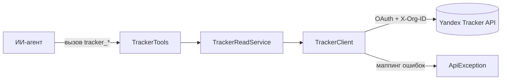

# Интеграция с Yandex Tracker: чтение и изменение (этапы M2–M3)

## Содержание

- [Краткое описание](#краткое-описание)
- [Для кого этот документ](#для-кого-этот-документ)
- [Зачем это нужно](#зачем-это-нужно)
- [Основные понятия](#основные-понятия)
- [Как это работает](#как-это-работает)
- [HTTP-клиент и заголовки](#http-клиент-и-заголовки)
- [Маппинг ошибок](#маппинг-ошибок)
- [Пагинация](#пагинация)
- [Режим только для чтения](#режим-только-для-чтения)
- [Инструменты чтения (этап M2)](#инструменты-чтения-этап-m2)
- [Инструменты изменения (этап M3)](#инструменты-изменения-этап-m3)
- [Формат ответов инструментов](#формат-ответов-инструментов)
- [Поиск и подсчёт задач](#поиск-и-подсчёт-задач)
- [Произвольные и пользовательские поля](#произвольные-и-пользовательские-поля)
- [Защита от конфликтов при изменении](#защита-от-конфликтов-при-изменении)
- [Состав компонентов](#состав-компонентов)
- [Тесты](#тесты)
- [Ограничения и важные условия](#ограничения-и-важные-условия)
- [Что дальше](#что-дальше)

## Краткое описание

Документ описывает реализацию работы с Yandex Tracker на этапах M2 (чтение) и M3 (изменение).
Сервер обращается к REST API Tracker по адресу `https://api.tracker.yandex.net`, добавляет
заголовки авторизации и организации, переводит ошибки API в понятные сообщения и предоставляет
агенту инструменты:

- чтение (M2): данные текущего пользователя, получение, поиск и подсчёт задач, список и параметры
  очередей, справочники;
- изменение (M3): создание и изменение задач, перенос между очередями, переходы по статусам,
  работа с комментариями и связями, а также сопутствующие операции чтения (доступные переходы,
  история изменений, список комментариев и связей).

Полный каталог планируемых возможностей Tracker описан отдельно в
[docs/capabilities/yandex-tracker-capabilities.md](./capabilities/yandex-tracker-capabilities.md).
Этот документ фиксирует именно то, что реализовано на этапах M2 и M3.

## Для кого этот документ

Документ рассчитан на смешанную аудиторию: разработчиков сервера и технических специалистов,
сопровождающих интеграцию. Сначала объясняется смысл, затем приводятся технические детали
(заголовки, коды ошибок, состав инструментов).

## Зачем это нужно

Чтобы ИИ-агент мог работать с задачами Tracker, серверу нужен надёжный слой обращения к API:
единая точка добавления авторизации, единообразная обработка ошибок и набор инструментов с
понятными параметрами. Этап M2 закладывает этот слой на операциях чтения — самых частых и
безопасных, — а изменяющие операции добавляются позже поверх той же инфраструктуры.

## Основные понятия

| Понятие | Простое объяснение |
|---|---|
| Issue (задача) | Основная единица работы: задача, баг, история; имеет ключ вида `TREK-42` |
| Queue (очередь) | Контейнер задач проекта или команды, например `TREK` |
| Язык запросов | Текстовый язык фильтрации задач Tracker, например `queue: TREK AND status: open` |
| Структурный фильтр | JSON-объект с условиями, например `{"queue":"TREK","assignee":"me"}` |
| Справочник | Список допустимых значений: типы задач, приоритеты, статусы, резолюции |
| Пагинация | Постраничная выдача больших списков параметрами `perPage` и `page` |

## Как это работает

Агент вызывает инструмент с префиксом `tracker_` и понятными параметрами. Инструмент делегирует
сервису чтения, тот собирает запрос и обращается к Tracker через общий HTTP-клиент. Клиент
добавляет заголовки авторизации и организации, отправляет запрос, разбирает ответ и при ошибке
бросает понятное исключение. Результат возвращается агенту в виде JSON-текста.



## HTTP-клиент и заголовки

Базовый адрес API задаётся свойством `yandex.tracker.base-url` (по умолчанию
`https://api.tracker.yandex.net`). Клиент `trackerRestClient` строится на `RestClient` и
использует интерсептор `YandexApiAuthInterceptor`, который добавляет в каждый запрос:

- `Authorization: OAuth <токен>` — действующий токен доступа. Токен запрашивается у
  `AuthService` на каждый запрос, поэтому после фонового обновления используется свежее значение.
- заголовок идентификатора организации — `X-Org-ID` для Яндекс 360 или `X-Cloud-Org-ID` для
  Yandex Cloud. Имя заголовка выбирается по свойству `yandex.org-type`, значение берётся из
  `yandex.org-id`.

Низкоуровневый клиент `TrackerClient` инкапсулирует построение строки запроса, сериализацию тела
в JSON, разбор ответа в `JsonNode` и маппинг ошибок. Поддерживаются методы `GET`, `POST`, `PATCH`
и `DELETE`; ответ `204 No Content` (например, после удаления) возвращается как `null`-узел.
Заголовки авторизации клиент не задаёт — это ответственность интерсептора, общего для Tracker и
будущего клиента Wiki.

## Маппинг ошибок

При ответе со статусом `4xx`/`5xx` клиент разбирает стандартное тело ошибки Tracker (массив
`errorMessages` и объект `errors`) и бросает `ApiException` с исходным статусом и понятным
сообщением.

| Статус | Сообщение |
|---|---|
| 400 | Некорректный запрос к API Tracker |
| 401 | Не авторизовано: токен недействителен или истёк, выполните авторизацию командой `auth` |
| 403 | Недостаточно прав для выполнения операции в Tracker |
| 404 | Объект не найден в Tracker |
| 409 | Конфликт изменений в Tracker |
| 412 | Конфликт версий объекта Tracker |
| 422 | Запрос к API Tracker не прошёл валидацию |
| 429 | Превышен лимит запросов к API Tracker |
| 5xx | Внутренняя ошибка сервиса Tracker |

К сообщению добавляются сведения из тела ответа и HTTP-статус, например:
`Объект не найден в Tracker: Issue does not exist. (HTTP 404)`.

## Пагинация

Списковые методы Tracker возвращают данные страницы в теле ответа, а общее число объектов и
страниц — в заголовках `X-Total-Count` и `X-Total-Pages`. Клиент читает эти заголовки и передаёт
их в результат `PagedResult`. Размер страницы и номер задаются параметрами `perPage` и `page`
(нумерация страниц с 1). По умолчанию Tracker отдаёт 50 объектов на страницу.

## Режим только для чтения

При запуске сервера с флагом `yandex.read-only=true` все изменяющие операции отклоняются до
обращения к API. Проверку выполняет общий компонент `WriteGuard`: перед каждой изменяющей
операцией сервис вызывает `ensureWritable`, и при включённом режиме бросается
`ReadOnlyModeException` с понятным сообщением. Инструменты чтения работают без ограничений.

## Инструменты чтения (этап M2)

Все перечисленные инструменты — только для чтения.

| Инструмент | Назначение | Метод и endpoint |
|---|---|---|
| `tracker_myself` | Данные текущего пользователя | `GET /v3/myself` |
| `tracker_issue_get` | Задача по ключу | `GET /v3/issues/{key}` |
| `tracker_issue_search` | Поиск задач по запросу или фильтру | `POST /v3/issues/_search` |
| `tracker_issue_count` | Количество задач по запросу или фильтру | `POST /v3/issues/_count` |
| `tracker_queue_list` | Список очередей | `GET /v3/queues` |
| `tracker_queue_get` | Параметры очереди | `GET /v3/queues/{id}` |
| `tracker_issuetype_list` | Справочник типов задач | `GET /v3/issuetypes` |
| `tracker_priority_list` | Справочник приоритетов | `GET /v3/priorities` |
| `tracker_status_list` | Справочник статусов | `GET /v3/statuses` |
| `tracker_resolution_list` | Справочник резолюций | `GET /v3/resolutions` |

## Инструменты изменения (этап M3)

Этап M3 добавляет изменяющие операции над задачами, комментариями и связями, а также
сопутствующие операции чтения. Изменяющие инструменты подчиняются режиму только для чтения.

Изменяющие инструменты:

| Инструмент | Назначение | Метод и endpoint |
|---|---|---|
| `tracker_issue_create` | Создать задачу | `POST /v3/issues` |
| `tracker_issue_update` | Изменить поля задачи | `PATCH /v3/issues/{key}` |
| `tracker_issue_move` | Перенести задачу в другую очередь | `POST /v3/issues/{key}/_move` |
| `tracker_issue_transition_execute` | Выполнить переход по статусу | `POST /v3/issues/{key}/transitions/{id}/_execute` |
| `tracker_comment_add` | Добавить комментарий | `POST /v3/issues/{key}/comments` |
| `tracker_comment_update` | Изменить комментарий | `PATCH /v3/issues/{key}/comments/{id}` |
| `tracker_comment_delete` | Удалить комментарий | `DELETE /v3/issues/{key}/comments/{id}` |
| `tracker_link_create` | Связать задачи | `POST /v3/issues/{key}/links` |
| `tracker_link_delete` | Удалить связь | `DELETE /v3/issues/{key}/links/{id}` |

Сопутствующие операции чтения:

| Инструмент | Назначение | Метод и endpoint |
|---|---|---|
| `tracker_issue_transitions_list` | Доступные переходы по статусам | `GET /v3/issues/{key}/transitions` |
| `tracker_issue_changelog` | История изменений задачи | `GET /v3/issues/{key}/changelog` |
| `tracker_comment_list` | Список комментариев задачи | `GET /v3/issues/{key}/comments` |
| `tracker_link_list` | Список связей задачи | `GET /v3/issues/{key}/links` |

## Формат ответов инструментов

Инструменты возвращают данные в виде форматированного JSON-текста, повторяя структуру ответа API
без преобразования полей. Это сохраняет произвольные и пользовательские поля задач, которые иначе
было бы легко потерять при ручном маппинге.

Постраничные инструменты (`tracker_issue_search`, `tracker_queue_list`) оборачивают результат в
объект со сведениями о пагинации:

```json
{
  "totalCount": 120,
  "totalPages": 3,
  "page": 2,
  "perPage": 50,
  "items": [ { "key": "TREK-1" } ]
}
```

Инструмент `tracker_issue_count` возвращает число в виде строки. Изменяющие инструменты создания и
изменения возвращают полученный от API объект, а инструменты удаления (`tracker_comment_delete`,
`tracker_link_delete`) — короткое подтверждение об успешном удалении.

## Поиск и подсчёт задач

Инструменты поиска и подсчёта принимают взаимодополняющие параметры:

- `query` — строка на языке запросов Tracker. Используется **самостоятельно**: при заданном
  `query` структурный фильтр, очередь и ключи игнорируются (так требует API).
- `filter` — JSON-объект структурного фильтра, например `{"assignee":"me"}`.
- `queue` — ключ очереди; добавляется в структурный фильтр как `queue`.
- `keys` — ключи задач через запятую для точечной выборки.
- `order` — сортировка (только для поиска), например `+status` или `-updated`.

Сборка тела запроса выполняется в `DefaultTrackerReadService`: при заданном `query` формируется
тело `{"query": ...}`, иначе — `{"filter": {...}, "keys": [...]}`. Некорректный JSON в параметре
`filter` приводит к понятной ошибке `ApiException` со статусом 400 ещё до обращения к API.

## Произвольные и пользовательские поля

Инструменты создания и изменения задач (`tracker_issue_create`, `tracker_issue_update`,
`tracker_issue_move`, `tracker_issue_transition_execute`) принимают частые поля отдельными
параметрами (`summary`, `description`, `type`, `priority`, `assignee`, `parent`), а всё остальное —
JSON-объектом `fields`. Это позволяет задавать любые поля Tracker, включая пользовательские, не
расширяя сигнатуру инструментов.

Тело запроса собирается в `DefaultTrackerWriteService`: сначала добавляются непустые явные поля,
затем поверх накладывается разобранный объект `fields`. Поэтому `fields` может как добавить новые
поля, так и переопределить значение, заданное явным параметром. Некорректный JSON в `fields`
приводит к ошибке `ApiException` со статусом 400 ещё до обращения к API.

## Защита от конфликтов при изменении

Инструмент `tracker_issue_update` принимает необязательный параметр `version` — номер версии
задачи. Он передаётся в запрос как параметр строки запроса `version`, и Tracker использует его для
защиты от конфликтов одновременного редактирования. Если версия устарела, API возвращает ошибку
конфликта (`409`/`412`), которая транслируется агенту понятным сообщением.

## Состав компонентов

| Компонент | Слой | Назначение |
|---|---|---|
| `TrackerTools` | `tracker/api` | Инструменты чтения: разбор параметров, форматирование результата |
| `TrackerWriteTools` | `tracker/api` | Инструменты изменения: задачи, комментарии, связи |
| `TrackerReadService` | `tracker/application` | Интерфейс чтения: сборка запросов поиска и подсчёта |
| `DefaultTrackerReadService` | `tracker/application` | Реализация сервиса чтения |
| `TrackerWriteService` | `tracker/application` | Интерфейс изменения данных |
| `DefaultTrackerWriteService` | `tracker/application` | Реализация изменения: сборка тел запросов, проверка режима записи |
| `PagedResult` | `tracker/domain` | Результат постраничного запроса (тело + метаданные пагинации) |
| `TrackerClient` | `tracker/infrastructure` | Низкоуровневый HTTP-клиент (`GET`/`POST`/`PATCH`/`DELETE`) с маппингом ошибок |
| `YandexApiAuthInterceptor` | `common` | Добавление заголовков авторизации и организации |
| `WriteGuard` | `common` | Проверка режима только для чтения перед изменяющими операциями |
| `ApiException` | `common` | Ошибка обращения к API со статусом и сообщением |
| `ReadOnlyModeException` | `common` | Ошибка попытки изменения в режиме только для чтения |
| `trackerRestClient` | `config` | Бин `RestClient` для API Tracker |

## Тесты

| Тест | Что проверяет |
|---|---|
| `TrackerClientTest` | Разбор тела, проброс параметров запроса, чтение заголовков пагинации, методы `PATCH`/`DELETE`, ответ `204`, маппинг ошибок 404 и 403 (через WireMock) |
| `DefaultTrackerReadServiceTest` | Сборка тела поиска: приоритет `query`, структурный фильтр с очередью и ключами, чтение числа подсчёта, ошибка некорректного фильтра |
| `DefaultTrackerWriteServiceTest` | Слияние явных полей и `fields`, проброс `version` и целевой очереди, тело связи и комментария, блокировка в режиме только для чтения, ошибка некорректного `fields` |
| `TrackerToolsTest` | Форматирование JSON, обёртка пагинации, вывод подсчёта строкой |
| `TrackerWriteToolsTest` | Форматирование результата создания, подтверждения удаления комментария и связи |

## Ограничения и важные условия

- Доступные данные и операции ограничены правами пользователя, которому принадлежит OAuth-токен.
  При нехватке прав API возвращает `403`.
- Изменяющие инструменты (этап M3) блокируются флагом `yandex.read-only`; инструменты чтения
  работают всегда.
- Повторные запросы при `429` и сетевых сбоях пока не выполняются; это запланировано на этап M6.
- Инструменты возвращают структуру ответа API как есть; нормализация и сокращение полей не
  выполняются.
- Чек-листы, учёт времени и вложения в M3 не входят; они запланированы на последующие этапы.

## Что дальше

| Этап | Содержание |
|---|---|
| M4 | Wiki: страницы, комментарии, вложения |
| M6 | Повторные запросы при ошибках, доводка режима `READ_ONLY`, расширение тестов |
