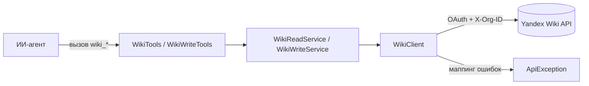

# Интеграция с Yandex Wiki: страницы, комментарии, вложения, таблицы (этапы M4–M5)

## Содержание

- [Краткое описание](#краткое-описание)
- [Для кого этот документ](#для-кого-этот-документ)
- [Зачем это нужно](#зачем-это-нужно)
- [Основные понятия](#основные-понятия)
- [Как это работает](#как-это-работает)
- [HTTP-клиент и заголовки](#http-клиент-и-заголовки)
- [Маппинг ошибок](#маппинг-ошибок)
- [Режим только для чтения](#режим-только-для-чтения)
- [Инструменты чтения](#инструменты-чтения)
- [Инструменты изменения](#инструменты-изменения)
- [Содержимое в формате Markdown](#содержимое-в-формате-markdown)
- [Загрузка вложений](#загрузка-вложений)
- [Удаление и восстановление страниц](#удаление-и-восстановление-страниц)
- [Динамические таблицы (этап M5)](#динамические-таблицы-этап-m5)
- [Состав компонентов](#состав-компонентов)
- [Тесты](#тесты)
- [Принятые решения и допущения](#принятые-решения-и-допущения)
- [Ограничения и важные условия](#ограничения-и-важные-условия)
- [Что дальше](#что-дальше)

## Краткое описание

Документ описывает реализацию работы с Yandex Wiki на этапе M4: страницы, комментарии и вложения.
Сервер обращается к REST API Wiki по адресу `https://api.wiki.yandex.net`, добавляет заголовки
авторизации и организации, переводит ошибки API в понятные сообщения и предоставляет агенту
инструменты чтения и изменения страниц, их содержимого, комментариев и вложений.

Этап M5 дополняет интеграцию работой с динамическими таблицами (grids): таблицы, строки, столбцы
и ячейки.

Полный каталог планируемых возможностей Wiki описан отдельно в
[docs/capabilities/yandex-wiki-capabilities.md](./capabilities/yandex-wiki-capabilities.md). Этот
документ фиксирует то, что реализовано на этапах M4 и M5.

## Для кого этот документ

Документ рассчитан на смешанную аудиторию: разработчиков сервера и технических специалистов,
сопровождающих интеграцию. Сначала объясняется смысл, затем приводятся технические детали.

## Зачем это нужно

Чтобы ИИ-агент мог вести базу знаний на естественном языке: читать и редактировать страницы,
добавлять комментарии и прикреплять файлы. MCP-сервер превращает методы REST API Wiki в понятные
инструменты с описанием и схемой параметров.

## Основные понятия

| Понятие | Простое объяснение |
|---|---|
| Page (страница) | Документ Wiki с заголовком и содержимым в формате Markdown |
| Slug | Человекочитаемый адрес страницы, например `team/onboarding` |
| Page ID | Числовой идентификатор страницы |
| Descendants (потомки) | Дерево вложенных страниц под выбранной страницей |
| Resource (ресурс) | Объект, прикреплённый к странице: вложение или таблица |
| Recovery token | Токен, возвращаемый при удалении страницы; позволяет её восстановить |
| Upload session | Сессия загрузки файла по частям |

## Как это работает

Агент вызывает инструмент с префиксом `wiki_`. Инструмент делегирует сервису, тот собирает запрос
и обращается к Wiki через общий HTTP-клиент `WikiClient`, который добавляет заголовки авторизации
и организации, отправляет запрос, разбирает ответ и при ошибке бросает понятное исключение.

## HTTP-клиент и заголовки

Базовый адрес API задаётся свойством `yandex.wiki.base-url` (по умолчанию
`https://api.wiki.yandex.net`). Клиент `wikiRestClient` строится на `RestClient` и использует тот
же интерсептор `YandexApiAuthInterceptor`, что и Tracker, добавляя в каждый запрос:

- `Authorization: OAuth <токен>` — действующий токен доступа (обновляется автоматически);
- заголовок идентификатора организации — `X-Org-ID` для Яндекс 360 или `X-Cloud-Org-ID` для
  Yandex Cloud.

Низкоуровневый клиент `WikiClient` поддерживает методы `GET`, `POST`, `DELETE`, `DELETE` с телом
(для пакетного удаления строк и столбцов таблиц) и бинарный `PUT` (`application/octet-stream`) для
загрузки частей файла. Ответ `204 No Content` возвращается как `null`-узел.

## Маппинг ошибок

Сопоставление HTTP-статусов с сообщениями выполняет общий компонент `ApiErrorTranslator` (тот же,
что и для Tracker), подставляя имя сервиса `Wiki`. Подробности извлекаются из тела ответа Wiki по
известным полям (`human_message`, `message`, `debug_message`, `detail`, `error_description`),
а также из массива `errorMessages` и объекта `errors`. Пример сообщения:
`Объект не найден в Wiki: Страница не найдена (HTTP 404)`.

## Режим только для чтения

При флаге `yandex.read-only=true` все изменяющие операции Wiki отклоняются компонентом `WriteGuard`
до обращения к API (исключение `ReadOnlyModeException`). Инструменты чтения работают без
ограничений.

## Инструменты чтения

| Инструмент | Назначение | Метод и endpoint |
|---|---|---|
| `wiki_page_get_by_slug` | Страница по адресу | `GET /v1/pages?slug=...` |
| `wiki_page_get_by_id` | Страница по идентификатору | `GET /v1/pages/{id}` |
| `wiki_page_get_descendants` | Дерево вложенных страниц | `GET /v1/pages/descendants?slug=...` |
| `wiki_page_get_resources` | Ресурсы страницы (вложения и таблицы) | `GET /v1/pages/{id}/resources` |
| `wiki_page_comments_list` | Комментарии страницы | `GET /v1/pages/{id}/comments` |
| `wiki_page_attachments_list` | Вложения страницы | `GET /v1/pages/{id}/attachments` |

## Инструменты изменения

Все изменяющие инструменты блокируются режимом только для чтения.

| Инструмент | Назначение | Метод и endpoint |
|---|---|---|
| `wiki_page_create` | Создать страницу | `POST /v1/pages` |
| `wiki_page_update` | Изменить заголовок/содержимое | `POST /v1/pages/{id}` |
| `wiki_page_delete` | Удалить страницу (вернёт токен восстановления) | `DELETE /v1/pages/{id}` |
| `wiki_page_recover` | Восстановить страницу по токену | `POST /v1/recovery_tokens/{token}/recover` |
| `wiki_page_clone` | Клонировать страницу | `POST /v1/pages/{id}/clone` |
| `wiki_page_append_content` | Дописать содержимое | `POST /v1/pages/{id}/append-content` |
| `wiki_page_comment_add` | Добавить комментарий или ответ | `POST /v1/pages/{id}/comments` |
| `wiki_page_attachment_upload` | Загрузить файл и прикрепить к странице | сессия загрузки → `POST /v1/pages/{id}/attachments` |
| `wiki_page_attachment_attach` | Прикрепить готовые сессии загрузки | `POST /v1/pages/{id}/attachments` |

## Содержимое в формате Markdown

Содержимое страниц передаётся и принимается в формате **Markdown**. Это относится к параметру
`content` инструментов `wiki_page_create`, `wiki_page_update` и `wiki_page_append_content`. Агент
должен формировать корректную Markdown-разметку.

Дополнение содержимого через `wiki_page_append_content` поддерживает место вставки: `bottom` (в
конец, по умолчанию на стороне API), `top` (в начало) или к якорю (`anchor`).

Произвольные поля задаются JSON-объектом `fields` (как и в Tracker): он накладывается поверх явных
параметров и может добавлять или переопределять любые поля запроса.

## Загрузка вложений

Инструмент `wiki_page_attachment_upload` инкапсулирует весь процесс загрузки файла:

1. читает файл по указанному пути, доступному серверу;
2. создаёт сессию загрузки (`POST /v1/upload_sessions`);
3. отправляет содержимое частями до 5 МБ (`PUT /v1/upload_sessions/{id}/upload_part?part_number=N`,
   `application/octet-stream`);
4. завершает сессию (`POST /v1/upload_sessions/{id}/finish`);
5. прикрепляет сессию к странице (`POST /v1/pages/{id}/attachments`).

Если файл уже загружен отдельно, его сессии можно прикрепить инструментом
`wiki_page_attachment_attach`, передав идентификаторы сессий через запятую.

## Удаление и восстановление страниц

Удаление страницы (`wiki_page_delete`) возвращает в теле ответа токен восстановления. Его нужно
сохранить: восстановление выполняется инструментом `wiki_page_recover` по этому токену
(`POST /v1/recovery_tokens/{token}/recover`).

## Динамические таблицы (этап M5)

Динамические таблицы (grids) — это таблицы данных, прикреплённые к странице, со строками,
столбцами и ячейками. Структуры тел запросов в API таблиц разнообразны (наборы строк, столбцов,
ячеек со значениями), поэтому изменяющие инструменты принимают тело как строку JSON-объекта в
параметре `body`. Агент формирует его по контракту API таблиц; сервер разбирает и пересылает тело
без изменения структуры. Изменяющие инструменты блокируются режимом только для чтения.

Чтение:

| Инструмент | Назначение | Метод и endpoint |
|---|---|---|
| `wiki_grid_get` | Получить таблицу | `GET /v1/grids/{id}` |
| `wiki_page_grids_list` | Список таблиц страницы | `GET /v1/pages/{id}/grids` |

Изменение:

| Инструмент | Назначение | Метод и endpoint |
|---|---|---|
| `wiki_grid_create` | Создать таблицу | `POST /v1/grids` |
| `wiki_grid_update` | Изменить заголовок/сортировку | `POST /v1/grids/{id}` |
| `wiki_grid_delete` | Удалить таблицу | `DELETE /v1/grids/{id}` |
| `wiki_grid_clone` | Клонировать таблицу | `POST /v1/grids/{id}/clone` |
| `wiki_grid_add_rows` | Добавить строки | `POST /v1/grids/{id}/rows` |
| `wiki_grid_delete_rows` | Удалить строки | `DELETE /v1/grids/{id}/rows` (тело) |
| `wiki_grid_move_row` | Переместить строку | `POST /v1/grids/{id}/rows/move` |
| `wiki_grid_add_columns` | Добавить столбцы | `POST /v1/grids/{id}/columns` |
| `wiki_grid_delete_columns` | Удалить столбцы | `DELETE /v1/grids/{id}/columns` (тело) |
| `wiki_grid_move_column` | Переместить столбец | `POST /v1/grids/{id}/columns/move` |
| `wiki_grid_update_cells` | Обновить значения ячеек | `POST /v1/grids/{id}/cells` |

## Состав компонентов

| Компонент | Слой | Назначение |
|---|---|---|
| `WikiTools` | `wiki/api` | Инструменты чтения Wiki |
| `WikiWriteTools` | `wiki/api` | Инструменты изменения: страницы, комментарии, вложения |
| `WikiReadService` | `wiki/application` | Интерфейс чтения данных Wiki |
| `DefaultWikiReadService` | `wiki/application` | Реализация чтения |
| `WikiWriteService` | `wiki/application` | Интерфейс изменения данных Wiki |
| `DefaultWikiWriteService` | `wiki/application` | Реализация изменения и оркестрация загрузки вложений |
| `WikiGridTools` | `wiki/api` | Инструменты динамических таблиц (чтение и изменение) |
| `WikiGridService` | `wiki/application` | Интерфейс работы с таблицами |
| `DefaultWikiGridService` | `wiki/application` | Реализация работы с таблицами, строками, столбцами, ячейками |
| `WikiClient` | `wiki/infrastructure` | Низкоуровневый HTTP-клиент (`GET`/`POST`/`DELETE`/`DELETE`-body/`PUT`-binary) |
| `ApiErrorTranslator` | `common` | Перевод HTTP-статусов в понятные сообщения (общий с Tracker) |
| `JsonFields` | `common` | Сборка тела запроса из явных полей и JSON-объекта (общий с Tracker) |
| `WriteGuard` | `common` | Проверка режима только для чтения |
| `wikiRestClient` | `config` | Бин `RestClient` для API Wiki |

## Тесты

| Тест | Что проверяет |
|---|---|
| `WikiClientTest` | Проброс параметров, разбор тела, токен восстановления при `DELETE`, бинарный `PUT`, маппинг ошибки 404 (через WireMock) |
| `DefaultWikiWriteServiceTest` | Сборка тел запросов, восстановление без тела, массив `upload_sessions`, оркестрация многочастной загрузки (порядок и номера частей), ошибки отсутствующего файла и пустых сессий, блокировка в режиме только для чтения |
| `DefaultWikiGridServiceTest` | Endpoint чтения таблиц, пересылка разобранного тела, `DELETE` с телом для строк, ошибка некорректного JSON, блокировка в режиме только для чтения |
| `WikiToolsTest` | Форматирование результата чтения в JSON |

## Принятые решения и допущения

- **Источник файла для загрузки** — локальный путь, доступный серверу (например, в подключённом
  томе `/data`). Это удобно для запуска в контейнере и не требует передачи больших файлов в
  аргументах инструмента.
- **Тело создания сессии загрузки** формируется как `{"name": <имя>, "size": <размер>}`, а
  идентификатор сессии извлекается из поля `id` (с запасным вариантом `session_id`). Эти детали
  основаны на документации возможностей и могут потребовать уточнения на реальном API.
- **Поле комментария** — `content`; **родитель комментария** — `parent_id`. При расхождении с
  реальным API значения легко скорректировать через параметр `fields`.

## Ограничения и важные условия

- Действия ограничены правами пользователя, которому выдан OAuth-токен.
- Содержимое страниц — Markdown; корректность разметки на стороне агента.
- Загрузка вложения читает файл целиком в память; подходит для типичных вложений, для очень
  больших файлов потребуется потоковая загрузка (кандидат на доработку).
- Повторные запросы при `429` и сетевых сбоях пока не выполняются (этап M6).
- Тела изменяющих операций с таблицами агент формирует сам как JSON-объект по контракту API;
  сервер их структуру не проверяет, кроме разбора корректности JSON.

## Что дальше

| Этап | Содержание |
|---|---|
| M6 | Повторные запросы при ошибках, доводка режима `READ_ONLY`, расширение тестов, доводка Docker |
